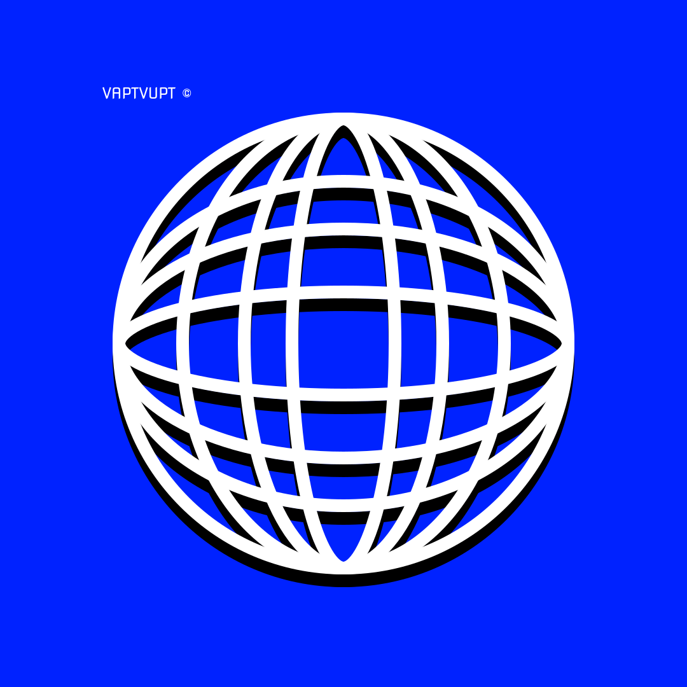

<div align="center">

<!-- LOGO & BANNER -->


<br/>

```
██╗   ██╗ █████╗ ██████╗ ████████╗    ██╗   ██╗██╗   ██╗██████╗ ████████╗
██║   ██║██╔══██╗██╔══██╗╚══██╔══╝    ██║   ██║██║   ██║██╔══██╗╚══██╔══╝
██║   ██║███████║██████╔╝   ██║       ██║   ██║██║   ██║██████╔╝   ██║   
╚██╗ ██╔╝██╔══██║██╔═══╝    ██║       ╚██╗ ██╔╝██║   ██║██╔═══╝    ██║   
 ╚████╔╝ ██║  ██║██║        ██║        ╚████╔╝ ╚██████╔╝██║        ██║   
  ╚═══╝  ╚═╝  ╚═╝╚═╝        ╚═╝         ╚═══╝   ╚═════╝ ╚═╝        ╚═╝  
```

### ✦ *Seu estoque avisa. O Vapt Vupt cota. Você repõe melhor.* ✦

<br/>


<br/>


</div>

<br/>

---

<div align="center">

> **⚠️ Aviso Importante**
>
> Este projeto é de **caráter exclusivamente acadêmico**, desenvolvido como trabalho de curso superior.
> Não possui fins lucrativos, não está em produção comercial e foi criado apenas para fins de apresentação e avaliação universitária.
> **Não são aceitas contribuições externas.**

</div>

---

<br/>

## 🗺️ Navegação Rápida

<div align="center">

[🎯 Sobre](#-sobre-o-projeto) • [✨ Funcionalidades](#-funcionalidades) • [🖥️ Telas](#️-telas-do-sistema) • [⚙️ Tecnologias](#️-stack-tecnológica) • [📊 Estatísticas](#-estatísticas-do-projeto) • [🚀 Como Rodar](#-como-rodar-localmente) • [🏛️ Estrutura](#️-estrutura-do-projeto) • [📜 Licença](#-licença)

</div>

<br/>

---

## 🎯 Sobre o Projeto

<br/>

O **Vapt Vupt** é uma **plataforma inteligente de cotação e reposição de estoque** desenvolvida para conectar pequenos e médios estabelecimentos comerciais a fornecedores qualificados — de forma rápida, automática e gratuita para o lojista.

O nome *"Vapt Vupt"* é uma expressão popular brasileira que transmite a essência da plataforma: **agilidade e praticidade**.

<br/>

```
┌─────────────────────────────────────────────────────────────────────┐
│                                                                     │
│   🏪  Estabelecimento                                               │
│   └── Estoque crítico detectado                                     │
│        └── 📋  Vapt Vupt gera cotação automática                   │
│              └── 🤝  Fornecedores recebem e respondem              │
│                    └── 💰  Você escolhe a melhor oferta            │
│                          └── ✅  Reposição feita com economia      │
│                                                                     │
└─────────────────────────────────────────────────────────────────────┘
```

<br/>

### 🎓 Contexto Acadêmico

Este projeto foi concebido e desenvolvido como **projeto de faculdade**, com o objetivo de simular uma solução real para o mercado de varejo e alimentação no Brasil. Toda a lógica de negócio, identidade visual, fluxo de UX e arquitetura foram planejados e executados do zero.

<br/>

---

## ✨ Funcionalidades

<br/>

### 🏪 Para Estabelecimentos

| Funcionalidade | Descrição |
|:---|:---|
| 🛒 **Catálogo de Produtos** | Navegue por mais de 40 produtos em 5 categorias |
| 📋 **Importação de Planilha** | Faça upload de `.xlsx` ou `.csv` para cotação em massa |
| 💬 **Cotação Automática** | O sistema identifica itens críticos e gera pedidos |
| 🔔 **Alertas de Estoque** | Notificações inteligentes para itens em falta |
| 🎁 **Promoções Exclusivas** | Acesso a ofertas especiais de fornecedores parceiros |
| 📊 **Dashboard Completo** | Acompanhe cotações ativas, recebidas e finalizadas |

<br/>

### 🤝 Para Fornecedores

| Funcionalidade | Descrição |
|:---|:---|
| 📥 **Recebimento de Cotações** | Acesse demandas qualificadas de compradores reais |
| 💼 **Portal Dedicado** | Interface exclusiva para gestão de propostas |
| 🔒 **Privacidade Protegida** | Dados de estabelecimentos ocultos até confirmação |

<br/>

### 🔒 Segurança & Conformidade

- **✅ LGPD Compliant** — Proteção total de dados pessoais conforme a lei brasileira
- **✅ XSS Prevention** — Sanitização de HTML em todas as entradas de usuário
- **✅ Content Security** — Headers de segurança configurados
- **✅ Referrer Policy** — Controle rigoroso de referências externas

<br/>

---

## 🖥️ Telas do Sistema

<br/>

O sistema é composto por **6 páginas** integradas em uma Single Page Application:

<br/>

```
                    ┌──────────────────────────────────────────────┐
                    │               VAPT VUPT — SPA                │
                    └──────────────────┬───────────────────────────┘
                                       │
          ┌────────────────────────────┼────────────────────────────┐
          │                            │                            │
    ┌─────▼──────┐             ┌───────▼──────┐             ┌──────▼─────┐
    │  🌐 Landing │             │  🔑 Login    │             │  📝 Cadastro│
    │   Page     │             │             │             │            │
    └────────────┘             └──────┬───────┘             └──────┬─────┘
                                      │                            │
                               ┌──────▼───────────────────────────▼─────┐
                               │              🎯 Onboarding              │
                               └──────────────────┬──────────────────────┘
                                                   │
                        ┌──────────────────────────┴──────────────────────────┐
                        │                                                      │
                ┌───────▼────────┐                                  ┌──────────▼──────┐
                │ 📊 Dashboard   │                                  │ 🏭 Fornecedor   │
                │ Estabelecimento│                                  │    Portal       │
                └────────────────┘                                  └─────────────────┘
```

<br/>

<details>
<summary><b>📄 Landing Page</b> — Clique para expandir</summary>

<br/>

Página pública de apresentação da plataforma com:

- **Hero Section** com proposta de valor e call-to-actions
- **Stats Section** com indicadores de impacto em tempo real
- **Como Funciona** — jornada em 3 passos ilustrados
- **Para Quem** — 8 segmentos de mercado atendidos
- **Diferenciais** — 6 diferenciais competitivos
- **Depoimentos** — avaliações de clientes fictícios
- **FAQ** — 6 perguntas frequentes com accordion
- **Footer** completo com links e informações legais

</details>

<details>
<summary><b>📊 Dashboard do Estabelecimento</b> — Clique para expandir</summary>

<br/>

Painel principal com:

- Visualização de cotações **Ativas**, **Recebidas** e **Finalizadas**
- Navegação por categorias: `💊 Farmácia` `🍺 Bebidas` `🥫 Alimentos` `🧹 Limpeza` `🥤 Descartáveis`
- Carrinho de compras com controle de quantidade
- Upload de planilha para cotação em lote
- Filtro de promoções e itens críticos
- Download de template padrão (`.xlsx`)

</details>

<details>
<summary><b>🏭 Portal do Fornecedor</b> — Clique para expandir</summary>

<br/>

Interface dedicada para fornecedores com:

- Visualização de pedidos recebidos por estabelecimentos
- Filtros por status e categoria
- Interface de resposta de cotações

</details>

<br/>

---

## ⚙️ Stack Tecnológica

<br/>

<div align="center">

```
╔══════════════════════════════════════════════════════════════╗
║                     TECH STACK OVERVIEW                      ║
╠══════════════════════════════════════════════════════════════╣
║  Frontend   │  HTML5 + CSS3 + Vanilla JavaScript (ES6+)      ║
║  Tipografia │  DM Sans — Google Fonts (Variable Weight)      ║
║  Ícones     │  SVG puro — zero dependências externas         ║
║  API        │  ViaCEP — preenchimento automático de endereço ║
║  Framework  │  Nenhum — SPA 100% vanilla, leve e rápida      ║
║  Segurança  │  XSS Prevention + LGPD + Content Headers       ║
╚══════════════════════════════════════════════════════════════╝
```

</div>

<br/>

### 🎨 Sistema de Design

O projeto possui um **Design System próprio** implementado via CSS Variables:

```css
/* Paleta de Cores */
--color-primary:    #0022FF   /* Azul identidade */
--color-success:    #22c55e   /* Verde confirmação */
--color-warning:    #f59e0b   /* Amarelo alerta */
--color-danger:     #ef4444   /* Vermelho crítico */

/* Tipografia */
font-family: 'DM Sans', sans-serif;   /* Variable font 300–700 */
```

<br/>

---

## 📊 Estatísticas do Projeto

<br/>

<div align="center">

| 📈 Indicador | 💡 Valor |
|:---:|:---:|
| Redução de rupturas de estoque | **73%** |
| Tempo médio de cotação | **12 minutos** |
| Economia média em compras | **18%** |
| Estabelecimentos simulados | **500+** |
| Tempo de resposta de fornecedores | **2–4 horas** |
| Categorias de produto | **5** |
| Produtos no catálogo | **40+** |
| Páginas da aplicação | **6** |

</div>

<br/>

---

## 🚀 Como Rodar Localmente

<br/>

> Não há dependências, build steps ou servidores necessários. O projeto roda diretamente no navegador.

<br/>

**1. Clone o repositório**
```bash
git clone https://github.com/jotape2709/vapt-vupt.git
cd vapt-vupt
```

**2. Abra no navegador**
```bash
# Opção A — Abrir diretamente
open index.html

# Opção B — Servir localmente (recomendado)
npx serve .
# ou
python -m http.server 8080
```

**3. Acesse**
```
http://localhost:8080
```

<br/>

> 💡 **Dica:** Para a melhor experiência, utilize o **Google Chrome** ou **Firefox** em versão atualizada.

<br/>

---

## 🏛️ Estrutura do Projeto

<br/>

```
vapt-vupt/
│
├── 📄 index.html          ← Landing page pública
├── 📄 vapt-vupt.html      ← Aplicação SPA (login → dashboard)
│
├── 📁 css/
│   └── 🎨 styles.css      ← Sistema de design global (CSS Variables)
│
├── 📁 js/
│   └── ⚡ app.js           ← Lógica da aplicação (1.361 linhas)
│
├── 📁 img/
│   └── 🖼️ favicon.svg     ← Logotipo vetorial da marca
│
└── 📜 LICENSE             ← Licença MIT
```

<br/>

---

## 🧩 Segmentos Atendidos

<br/>

<div align="center">

| 🏥 Farmácias | 🍷 Adegas | 🍺 Bares | 🍽️ Restaurantes |
|:---:|:---:|:---:|:---:|
| 🛒 Mercados | ☕ Cafeterias | 🐾 Pet Shops | 🏪 Conveniências |

</div>

<br/>

---

## 🎓 Sobre o Autor

<br/>

<div align="center">

[](https://github.com/jotape2709)

<br/>

*Projeto acadêmico — Ensino Superior*
*© 2026 · Todos os direitos reservados*

</div>

<br/>

---

## 📜 Licença

<br/>

```
MIT License

Copyright (c) 2026 João Pedro

Permission is hereby granted, free of charge, to any person obtaining a copy
of this software and associated documentation files (the "Software"), to deal
in the Software without restriction, including without limitation the rights
to use, copy, modify, merge, publish, distribute, sublicense, and/or sell
copies of the Software, and to permit persons to whom the Software is
furnished to do so, subject to the following conditions:

The above copyright notice and this permission notice shall be included in all
copies or substantial portions of the Software.
```

> ⚠️ Este repositório é de **uso pessoal e acadêmico**. Não são aceitas *pull requests*, *issues* de feature request ou qualquer forma de contribuição externa. O código está disponível publicamente apenas para fins de portfólio e avaliação acadêmica.

<br/>

---

<div align="center">

```
  ✦ ────────────────────────────────────────── ✦
       Vapt Vupt  ·  Projeto Acadêmico  ·  2026
  ✦ ────────────────────────────────────────── ✦
```

**Feito com dedicação para a apresentação na faculdade** 🎓

</div>
